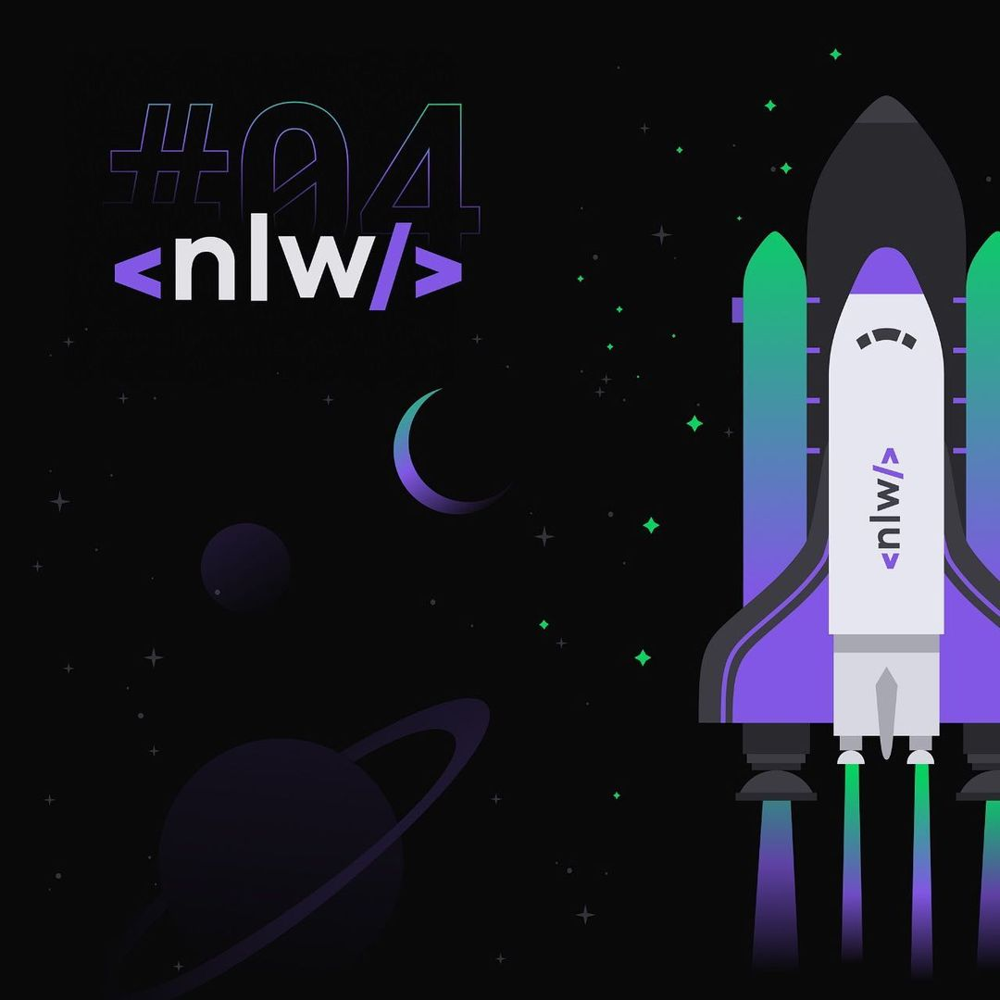

<h3 align="center">
  
</h3>

<h3 align="center">
  
</h3>

<h3 align="center">
  Move.it | Mantenha-se em foco e melhore seu bem-estar digital, utilizando a metodologia Pomodoro de produtividade
</h3>


## 🌟 Diferenciais e novidades

- [x] Tela de login para usuários do GitHub
- [ ] Ranking de usuários
- [ ] Configurações e theme changer
- [ ] Compartilhar nível e progresso nas redes sociais

O layout final do Move.it 2.0 pode ser acessado na plataforma __Figma__ através [deste link](https://www.figma.com/file/AOkfgVuSTgJiOxa7eQ4Ary/Move.it-2.0?node-id=160%3A2761)

## 🖥️ Tecnologias Utilizadas

* ⚛️ ReactJS - Framework para a criação de interfaces modernas, fluidas e com design responsivo em diversos dispositivos, utilizando JavaScript
* 🇳 NextJS - Framework do React para melhora considerável na estrutura da página e para facilitar a indexação e o contato com o Back-end
* ⌨️ TypeScritpt - Linguagem de programação semelhante a JavaScript, com algumas funcionalidades a mais, que combinadas com ReactJS, fazem da aplicação ainda mais interativa e à prova de erros

## ❓ Como Executar
Primeiramente, é necessário ter o [Git](https://git-scm.com/downloads), o [Node.js](https://nodejs.org/en/download/) e o [Yarn](https://yarnpkg.com/) instalados no seu sistema. Assim que esse pré-requisito for atendido, basta executar estes comandos, um a um, no seu Terminal ou Shell de preferência:

```
# Clone the repository
git clone https://github.com/Educg550/Move.it_2.0.git

# Enter in the project folder
cd Move.it_2.0

# Install dependencies
yarn

# Compile the latest build
yarn build

# Start the project
yarn start
```

Assim que o servidor for iniciado, ele será hospedado no seguinte endereço: ```localhost:3000```
<br>
Basta inserir este mesmo endereço no seu navegador de preferência e testar a aplicação.
<br>
<br>
Alternativamente, você pode abrir o projeto publicado na plataforma **Vercel**, clicando [aqui](https://moveit-react-nlw-zeta.vercel.app/)

## 📓 Caderno de Anotações
Meu caderno com as anotações referentes ao conteúdo da Next Level Week #4 pode ser encontrado [neste link](https://www.notion.so/Next-Level-Week-4-7355b15061fa4a06a5ca9ee78fcd621d), utilizando a plataforma **Notion**.

## 🚀 Next Level Week #4


